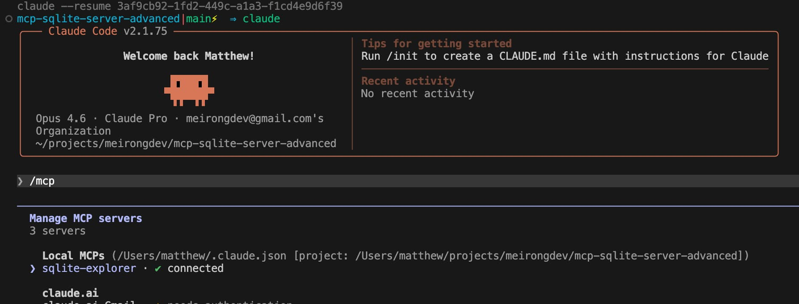

# MCP SQLite Server - Advanced Learning Project

This repository is a learning/example project that implements a Model Context Protocol (MCP) server backed by SQLite. It demonstrates advanced MCP features such as resource templates, dynamic tool management, and client-side input elicitation, using modern TypeScript practices (2026 standards).

## Quick start

### Requirements

- Node.js 24+ (Latest LTS recommended, managed via `fnm`)
- npm

### Installation

```bash
npm install
```

### Database Setup

Seed the database with example data:

```bash
npm run seed
# Runs: tsx src/setupDb.ts
# Creates: src/database.db
```

### Development

Run the server in watch mode:

```bash
npm run dev
# Runs: tsx watch src/server.ts
```

### Testing

Run unit tests with Vitest:

```bash
npm test
# Runs: vitest run
```

### Building for Production

Type-check and build to `dist/`:

```bash
npm run typecheck
npm run build
```

Run the production build:

```bash
npm start
# Runs: node dist/server.js
```

## Features & capabilities

- **Resources:** Exposes table schemas via `schema://table/{tableName}`.
- **Prompts:** `query-table` helper for constructing SQL queries.
- **Tools:**
  - `listTables`: Lists all tables in the database.
  - `createTable`: Creates a new table (DDL).
  - `executeModification`: Executes UPDATE operations (disabled by default).
  - `adminLogin`: Enables dangerous tools like `executeModification`.
  - `addUser`: Demonstrates **client-side elicitation** (asking the user for input) to add a user.

## Modernization Highlights

This project has been refactored to align with 2026 TypeScript best practices:

- **Runtime:** Uses `tsx` for fast, native ESM execution during development.
- **Database:** Uses `sqlite` (wrapper around `sqlite3`) for a robust, Promise-based API.
- **Testing:** Integrated `vitest` for modern, fast unit testing.
- **Type Safety:** Strict TypeScript configuration, Zod validation for all inputs, and removal of `any` types.
- **Clean Architecture:** Source files are kept clean (no generated `.js`/`.d.ts` in `src/`), with build artifacts isolated in `dist/`.
- **Security:** Secrets are managed via environment variables (e.g., `ADMIN_PASSWORD`), and database connections are safely handled in `finally` blocks.

## Claude code Integration

start the server using the following command:

```bash
npm run dev
```

add the server to Claude's MCP client with:

```bash
claude mcp add sqlite-explorer -- npx tsx /Users/matthew/projects/meirongdev/mcp-sqlite-server-advanced/src/run-stdio.ts
```


